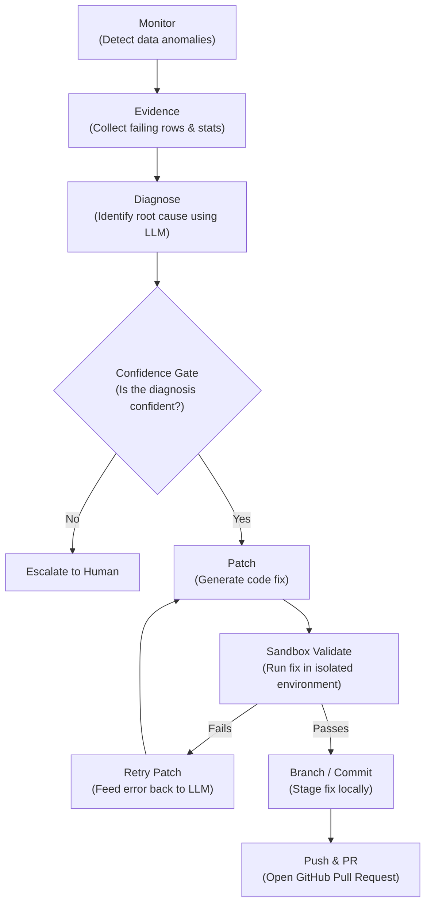

# DataMedic

DataMedic is an automated, AI-driven data quality assistant that watches a data pipeline, detects failures, diagnoses the root cause of the issue, and proposes a validated code fix via a pull request. Crucially, DataMedic is designed to be a safe "human-in-the-loop" tool: it never edits the live pipeline directly, but instead thoroughly validates its proposed patches in an isolated sandbox before staging them for a human to review and approve.

## Why this matters

Silent data pipeline failures are notoriously dangerous because they don't crash the script; they quietly corrupt the output data that downstream systems and business decisions rely on. A famous cautionary tale is the Zillow Offers failure, where unhandled data anomalies in their pricing models went undetected and ultimately contributed to hundreds of millions in losses. While DataMedic isn't a silver bullet that would have automatically prevented that specific catastrophe, it was built specifically to catch, diagnose, and propose fixes for these types of silent data corruptions *before* they poison the downstream data warehouse.

## Architecture

DataMedic follows a strict, safe execution flow:



## Proof it works

To see what the output of this entire pipeline looks like in reality, check out our live example Pull Request:
[**#1: Fix duplicate transaction IDs handled deterministically**](https://github.com/Shlokbhandari/Data-Medic/pull/1)

This PR was entirely generated by the DataMedic pipeline: it detected the issue, diagnosed the root cause, wrote the fix, validated it in a sandbox, and opened the PR with a detailed explanation of the evidence and validation results.

## Setup

To run DataMedic yourself, follow these steps:

1. **Clone the repository:**
   ```bash
   git clone https://github.com/Shlokbhandari/Data-Medic.git
   cd Data-Medic
   ```

2. **Create and activate a virtual environment:**
   ```bash
   python -m venv venv
   source venv/bin/activate
   ```

3. **Install dependencies:**
   ```bash
   pip install -r requirements.txt
   ```

4. **Set up your environment variables:**
   Create a `.env` file in the project root and add your API keys:
   ```env
   GROQ_API_KEY=your_groq_api_key_here
   GITHUB_TOKEN=your_github_personal_access_token
   ```
   *Note: DataMedic uses Groq for fast LLM inference by default. If Groq is unavailable, you can configure it to fall back to a local Ollama instance.*

## Running the demo

We've provided a reference script that executes the entire DataMedic loop end-to-end on a broken dataset. To see the pipeline detect the failure, write a patch, validate it, and open a PR, simply run:

```bash
python pipeline/run_live_demo.py
```

## Current Scope

DataMedic is an actively growing project. Currently, it fully handles one failure type from end-to-end:
- **Duplicate transaction IDs**: Detected, diagnosed, patched, validated, and pushed.

It also successfully monitors and detects two other issues, which are currently escalated to humans (auto-fixing is not yet built):
- **Missing prices**
- **Suspicious zero values**

For a full breakdown of the failure types we track and their current development status, see [benchmark.md](benchmark.md).
